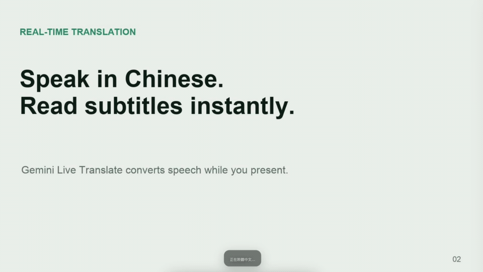

# Live Caption Studio

[](LICENSE)
[](#開始使用)
[](https://www.python.org/downloads/)
[](https://github.com/miami1124/Live-Caption-Studio/actions/workflows/test.yml)

用中文報告，台下即時看到英文、日文或韓文字幕——字幕直接疊在你的 PDF 簡報上。

這是一套**在你自己電腦上執行**的開源工具。你用自己的 Gemini API key，上傳簡報 PDF 就能開始使用。



*實際錄影：講者說中文，翻譯字幕即時出現在投影片下方。*

<details>
<summary><b>目錄</b></summary>

- [三步驟開始](#三步驟開始)
- [卡住的話，讓 AI 幫你排查](#-卡住的話讓-ai-幫你排查)
- [適合什麼場合](#適合什麼場合)
- [開始使用](#開始使用) — 安裝、安全警告、取得並填入 API key
- [怎麼用](#怎麼用) — 開始前設定、簡報進行中、快捷鍵
- [遇到問題](#遇到問題)
- [你的資料去了哪裡](#你的資料去了哪裡) — **使用免費額度前請先讀**
- [這個工具能做到什麼、做不到什麼](#這個工具能做到什麼做不到什麼)
- [回報問題](#回報問題)
- [開發](#開發)
- [關於作者](#關於作者)
- [授權](#授權)

</details>

## 三步驟開始

1. 按這個頁面上方的 **Code → Download ZIP**，下載後解壓縮
2. 打開資料夾，雙擊 **`start.bat`**（Windows）或 **`start.command`**（macOS）；Linux 執行 **`./start.sh`**
3. 等 1-2 分鐘裝好，瀏覽器會自己開啟

需要電腦有 **Python 3.10 以上**；如果尚未安裝，請照下方對應系統的說明操作。

有兩件事先講，遇到才不會嚇到：

- **第一次啟動會被系統的安全機制擋下來**，這是正常的。[往下看原因和處理方式](#開始使用)
- **啟動的那個視窗要留著**，它就是程式本身，關掉程式就結束了。縮到最小沒關係。

各系統的完整說明和已知地雷：[Windows](install/windows.md) · [macOS](install/macos.md) · [Linux](install/linux.md)

## 💡 卡住的話，讓 AI 幫你排查

**可以把下面這段整個複製給你的 AI**（Claude Code、Codex）：

```text
請幫我安裝這個工具：https://github.com/miami1124/Live-Caption-Studio

請先讀該 repo 的 AGENTS.md 再動作（如果你是 Claude Code，讀 CLAUDE.md），
裡面有完整安裝流程和各系統的已知地雷。

請先確認我的作業系統，再照對應的注意事項處理：

【Windows】
先跑 where python。路徑含 WindowsApps 代表 python 指到 Microsoft Store 版，
它缺少 ensurepip，虛擬環境會建不起來。
但先別叫我重裝——官方版可能早就裝好、只是排在後面。
請先跑 py -3.12 --version 確認：有版本號就一律改用 py -3.12，
真的沒有才安裝官方版。

【如果你是在沙盒或受限環境裡執行】
遇到 ensurepip 失敗、暫存目錄權限被拒、或你開的視窗被系統關掉，
那是你的執行環境限制，不是這個專案的問題。
請不要繼續想辦法繞過，直接叫我自己雙擊 start.bat 就好，兩分鐘的事。

【macOS】
start.command 第一次一定會被 Gatekeeper 擋（Apple 無法驗證）。
注意：macOS 15 以上「右鍵 → 打開」已經沒有「仍要打開」選項了，別叫我用那招。
正解是「系統設定 → 隱私權與安全性 → 安全性區塊 → 仍要打開」，
或直接在終端機執行 xattr -d com.apple.quarantine start.command start.sh。

【Linux】
可能要先安裝 python3-venv。

【共通】
所有指令都必須在專案資料夾內執行（有 app.py 的那層），不要在家目錄下指令。

裝好後請告訴我：要打開哪個網址、以及啟動用的終端機視窗能不能關掉。
```

> 這個專案為此準備了 [AGENTS.md](AGENTS.md)（Codex、Cursor 等）與 [CLAUDE.md](CLAUDE.md)（Claude Code），裡面是精確到資料夾的指令、已知失敗模式對照表和驗證方式。
>
> 已經自己下載好 ZIP 的話，直接在那個資料夾開啟 AI 工具，跟它說「讀 AGENTS.md 幫我安裝」就好。

**先講一個預期**：有些 AI 的執行環境有權限限制，可能會幫你查到一半、然後請你自己雙擊啟動檔完成——**那是正常的，不是壞掉**。實測上 AI 很擅長診斷問題（幫你確認 Python 版本、找出卡在哪），但最後一哩路自己雙擊往往還比較快。

## 適合什麼場合

上台報告時台下有聽不懂中文的人。在台上可以講中文，翻譯字幕就可以顯示在簡報上，跨越語言的問題，讓全場人都能聽懂你的簡報。

---

## 開始使用

### 1. 依你的系統安裝

各系統的地雷不一樣，請照著自己的那份走：

| 系統 | 安裝說明 | 特別注意 |
|---|---|---|
| **Windows** | [install/windows.md](install/windows.md) | ⚠️ 一定要裝 python.org 官方版，不能用 Microsoft Store 版 |
| **macOS** | [install/macos.md](install/macos.md) | 第一次會被 Gatekeeper 擋下，裡面有放行步驟 |
| **Linux** | [install/linux.md](install/linux.md) | 可能要先裝 `python3-venv` |

共通條件：**Python 3.10 以上**，瀏覽器用**最新版 Chrome 或 Edge**。

第一次啟動會自動建立環境並安裝套件（約 1-2 分鐘），完成後瀏覽器會開啟 `http://127.0.0.1:5090`。

### ⚠️ 系統會跳出安全警告，這是正常的——但你應該知道為什麼

第一次啟動時，macOS 會說「**Apple 無法驗證是否為惡意軟體**」，Windows 也可能跳安全性警告。

那句話的準確意思是：**系統無法驗證開發者身分與公證狀態。這不代表程式有害，但也不代表程式一定安全。**

之所以沒有簽章，是因為要加入 Apple Developer Program（一年 US$99）並跑公證流程，免費的開源工具通常不會付這筆錢。但**這個理由本身不構成「你應該放行」**——請確認下載來源與原始碼後，再自己決定要不要執行。

**所以你有三個選擇：**

#### 1. 自己驗證程式碼（最推薦）

這個工具**原始碼完全公開**，你可以在安裝前先審。最快的方式是把連結丟給你的 AI：

```text
請幫我檢查這個開源專案有沒有安全疑慮：
https://github.com/miami1124/Live-Caption-Studio

我想知道：
1. 它會不會偷偷把我的資料傳到哪裡
2. 它會不會動到我電腦的系統設定或刪除我的檔案
3. 有沒有可疑或被混淆過的程式碼
```

閉源軟體再怎麼簽章你也看不到裡面，開源的反而可以逐行檢查。

#### 2. 用終端機啟動，完全不碰安全設定

從終端機直接執行不會觸發 Gatekeeper（那是 Finder 雙擊才會啟動的機制）：

```bash
cd 你放這個工具的資料夾
./start.sh
```

#### 3. 放行一次

各系統的步驟寫在上面的安裝說明裡。

> **順帶一提，這個工具實際上會碰你電腦的哪些地方：**
> 只在專案資料夾裡建一個 `.venv`（放 Python 套件），以及在系統暫存區放 PDF 轉出來的圖片。
> **不改任何系統設定、不裝全域套件。解除安裝就是把資料夾丟到垃圾桶。**

### 2. 取得 Gemini API key

到 [Google AI Studio](https://aistudio.google.com/app/apikey) 建立一組。是否有免費額度與這個預覽模型的使用權限，以你的 Google 專案當下顯示為準；用量與費用都算在你自己的專案上。

### 3. 填入 API key

程式打開後，展開畫面上的「聲音與連線」，把剛剛複製的 key 貼進去就好。這個頁面執行在你自己的電腦（`127.0.0.1`），不是作者架設的網站。

key 會先交給本機程式並暫存在記憶體，**不會傳到作者管理的伺服器，也不會寫進檔案或瀏覽器儲存空間**。翻譯時，本機程式會把 key 送給 Google Gemini 驗證；關掉程式後就會清除，下次開啟再貼一次即可。

想確認完整資料流與防護方式，可以查看 [SECURITY.md](SECURITY.md) 和公開原始碼。

如果 key 不小心外流了，到 [Google AI Studio](https://aistudio.google.com/app/apikey) 把它刪掉重建一組就好。

---

## 怎麼用

### 開始前設定

第一次打開程式時，畫面會直接標出每個設定的用途；之後想重看，可以按右上角的「使用說明」。

畫面上三項，全部亮綠燈才能進簡報：

1. **簡報檔案** — 拖曳或選擇 PDF。Keynote / PowerPoint / Google Slides 都請先匯出成 PDF
2. **字幕語言** — 台下會看到的語言（你講的還是中文）
3. **聲音與連線** — 選麥克風、貼 API key

**強烈建議按一次「測試聲音」**。右邊的條會跳，就代表收得到你的聲音。跳過這步偶爾會遇到上台後按了翻譯卻沒字幕。

### 簡報進行中

第一次進入簡報畫面時會先看到一輪功能提示；關閉後畫面會保持乾淨，因為投影幕就是這個畫面，台下也在看。之後可從設定面板重新開啟「操作說明」。

- **控制列**：把滑鼠移到畫面**最下面**才會浮出來，停幾秒自己收掉。翻頁、按快捷鍵都不會叫它出來
- **字幕位置**：用滑鼠**直接拖**字幕到你想要的地方，位置會記住。拖丟了就到設定面板按「字幕位置歸位」
- **斷線**：只有連線出問題才會從上面滑下一條提示，同時把字幕調暗，讓你知道螢幕上那句是舊的

### 快捷鍵

| 按鍵 | 功能 |
|---|---|
| `M` | 開始／停止翻譯 |
| `S` | 開關設定面板 |
| `C` | 顯示／隱藏中文對照 |
| `P` | 開關字幕浮窗（需 Chrome 116+／Edge）|
| `F` | 全螢幕 |
| `←` `→`、空白鍵 | 投影片翻頁 |
| `+` `-` | 字幕放大／縮小 |

沒有 PDF 也想先試？用 [`sample/sample-presentation.pdf`](sample/sample-presentation.pdf)。

---

## 遇到問題

### macOS：跳出「Apple 無法驗證是否為惡意軟體」

意思是系統無法驗證開發者身分，不代表程式有害、也不代表一定安全（詳見上方[安全警告那節](#️-系統會跳出安全警告這是正常的但你應該知道為什麼)）。確認過來源後，放行一次就好：

1. 先按「**完成**」關掉那個視窗
2. 打開「**系統設定**」→「**隱私權與安全性**」
3. 往下捲到「**安全性**」，會看到「已封鎖使用 `start.command`」
4. 按「**仍要打開**」，用密碼或 Touch ID 確認

> ⚠️ 網路上很多教學說「右鍵 →『打開』」——**那是舊版 macOS 的做法，在 macOS 15 以上已經失效**，對話框只會給你「完成」和「丟到垃圾桶」。請用上面的系統設定路徑。

嫌麻煩的話，終端機一行也可以：

```bash
cd ~/Downloads/Live-Caption-Studio-main    # 換成你放的位置
xattr -d com.apple.quarantine start.command start.sh
```

詳細說明見 [install/macos.md](install/macos.md)。

### 網頁變成「無法連上這個網站」，或畫面出現「程式已經停止執行了」

兩種都是同一件事：**程式已經不在了。** 網頁如果還開著，按鈕會沒反應、上傳 PDF 會失敗；重新整理就會變成無法連線。

**啟動時開的那個終端機視窗，就是程式本身。** 視窗關掉、終端機 App 關掉、或按了 `Ctrl+C`，程式就結束了——就像關掉 Word 視窗，Word 就關了一樣。

所以用 `start.command` / `start.bat` / `start.sh` 啟動後，**那個視窗要留著**。縮到最小沒關係，關掉就是結束。

如果你希望它在背景一直跑、關掉終端機也不受影響（macOS／Linux）：

```bash
cd 你放這個工具的資料夾
nohup .venv/bin/python app.py > /tmp/live-caption.log 2>&1 &
```

之後要停掉：

```bash
kill $(lsof -ti :5090)
```

要看它有沒有出錯，訊息都在 `/tmp/live-caption.log`。

### 按了「開始翻譯」但完全沒字幕

1. 回到設定頁按「**測試聲音**」，確認音量條會跳
2. 檢查瀏覽器有沒有擋掉麥克風權限（網址列左邊的圖示）
3. 用的是藍牙耳機或外接麥克風？在「聲音與連線」的下拉選單改選正確的裝置
4. 翻譯中如果連續十幾秒收不到任何聲音，畫面上方會自己跳出提示

### 找不到「開始翻譯」按鈕

把滑鼠移到畫面**最底部**，控制列就會浮出來。或直接按 `M`。

### 字幕擋到投影片內容

用滑鼠抓著字幕拖走就好，它會記住新位置。

### 字幕跟不上／延遲很久

檢查網路。音訊是即時傳到 Google 的，網路不穩就會延遲或斷線。

### 出現「額度用完」

你的 Google 專案額度或速率限制到了，到 Google AI Studio 查看。

### 出現「API key 無效」或「翻譯模型無法使用」

先確認 key 沒貼錯、沒多空格。如果確定沒錯，問題可能是**你的 key 沒有這個預覽模型的存取權限**——Live Translate 還在 public preview，不是每組 key 都開放。到 [Google AI Studio](https://aistudio.google.com/app/apikey) 用同一個帳號重新建一組最新的 key 再試。

---

## 你的資料去了哪裡

### ⚠️ 使用免費額度前，請先讀這段

**Google 對免費 Gemini API 的規定跟付費的不一樣。** 官方條款原文：

> "human reviewers may read, annotate, and process your API input and output"
> **"Do not submit sensitive, confidential, or personal information to the Unpaid Services."**
> — [Gemini API Terms of Service](https://ai.google.dev/gemini-api/terms)

翻成白話：**用免費額度時，你講的話可能被 Google 用來改善產品，也可能被人工審閱。Google 明文要求不要送機密或個人敏感資訊。**

這個工具送出去的是**你在台上講的每一句話**。所以：

| 你的簡報內容 | 建議 |
|---|---|
| 公開演講、教學、對外分享 | 免費額度就可以 |
| **公司內部資料、未公開研究、客戶資訊、個人隱私** | **改用付費專案**，或不要用這個工具 |

付費專案的條款明確寫「Google doesn't use your prompts or responses to improve our products」。歐盟、瑞士、英國的使用者即使用免費額度也適用付費層的保護。

### 實際的資料流動

- **簡報 PDF 不會上網。** 只在你自己電腦裡轉成圖片，放在系統暫存資料夾
- **麥克風收到的聲音會傳給 Google Gemini。** 這是翻譯必要的
- **你的 API key 也會傳給 Google**（用來驗證身分），這是所有使用 Google API 的程式都一樣
- 本工具本身**不保存**你的錄音、逐字稿或字幕
- 暫存的投影片圖片在**正常關閉程式時**刪除。如果程式當機或電腦強制關機可能會留下，下次啟動時會自動清掉超過一天的舊檔
- 這個程式只在你這台電腦上開放，**同一個 Wi-Fi 底下的其他人連不進來**

## 這個工具能做到什麼、做不到什麼

先講清楚範圍，免得你裝好才發現不合用：

**做得到**：你講中文，台下即時看到英文／日文／韓文字幕，疊在你的 PDF 簡報上。

**做不到**：
- 講中文以外的語言（來源語言固定中文）
- 輸出英日韓以外的語言
- 保證專有名詞正確——公司名、人名、術語會被翻錯，而且每次錯法不一樣
- 讀取加密、損毀、超過 50 MB 或超過 200 頁的 PDF
- 字幕換行（一律單行，太長的句子會自動縮小字級）

**需要注意**：

- **翻譯用的 `gemini-3.5-live-translate-preview` 還在預覽階段。** Google 調整格式或暫停服務時，這個工具可能會突然無法翻譯。遇到的話多半不是你設定錯，等我跟進更新即可——[開個 Issue](../../issues) 告訴我最快。
- 字幕浮窗需要 Chrome 116 以上或 Edge；用其他瀏覽器字幕還是會正常疊在投影片上，只是沒有浮窗。
- API 的額度、速率限制與可能的費用，都算在你自己的 Google 專案上。

---

## 回報問題

這個工具目前是公開預覽版，**最有價值的回報是「你卡在哪裡」**——那些是我自己一台電腦永遠測不出來的。

請開一個 [Issue](../../issues)，告訴我這四件事就好：

1. 你的**作業系統與版本**（Windows、macOS 或 Linux）
2. **卡在哪一個步驟**（下載、啟動、填 key、按開始翻譯…）
3. 最後**有沒有成功看到字幕**
4. 有的話，**翻譯的速度和準確度**用起來如何

畫面上如果有紅色錯誤訊息，連那句一起貼給我。啟動的那個終端機視窗裡的最後幾行也很有幫助。

> 安全性相關的問題請不要開公開 Issue，改看 [SECURITY.md](SECURITY.md)。

---

## 開發

```bash
python3 -m venv .venv
source .venv/bin/activate
python -m pip install -r requirements.txt
python -m unittest discover -s tests -v
python app.py
```

### 每次都要重貼 key 很煩？

常常使用的話，可以把 key 寫進專案資料夾裡的 `.env`，程式啟動時會自動讀取：

```bash
cp -n .env.example .env    # -n 的意思是「已經有就不要覆蓋」，別省略
```

然後編輯 `.env`（macOS `open -e .env`／Windows `notepad .env`）填入：

```dotenv
GEMINI_API_KEY=你的_API_key
```

這個檔案只存在你自己的電腦裡。`.gitignore` 已經排除它，正常操作不會誤傳到 GitHub。

### 其他

若環境裡已有 `GEMINI_API_KEY`，可以驗證 Gemini Live Translate 握手：

```bash
python scripts/gemini_smoke_test.py
```

> 改 `templates/` 底下的檔案後**要重開 server**才會生效（Flask 在非 debug 模式會快取模板）。改 CSS / JS 只要重整瀏覽器。

---

## 關於作者

**SAM（張莆崧）** — AI 自動化工作者，用 n8n 和 Claude Code 做自動化與工具。

這個工具的起點是一場真實的需求：在中研院用中文做報告，台下有聽不懂中文的外國學者。實際上台用過之後，才慢慢補成現在這個樣子。

- GitHub：[@miami1124](https://github.com/miami1124)
- Threads：[@pusung.305](https://www.threads.net/@pusung.305)
- Instagram：[@pusung.ai](https://www.instagram.com/pusung.ai/)

歡迎回報使用狀況，特別是**卡住的地方**——那些是我自己一台電腦測不出來的。

## 授權

[MIT License](LICENSE)。PDF 轉圖使用 [pypdfium2](https://github.com/pypdfium2-team/pypdfium2)，其本身採 Apache-2.0／BSD-3-Clause，並包含 PDFium 的第三方授權。
