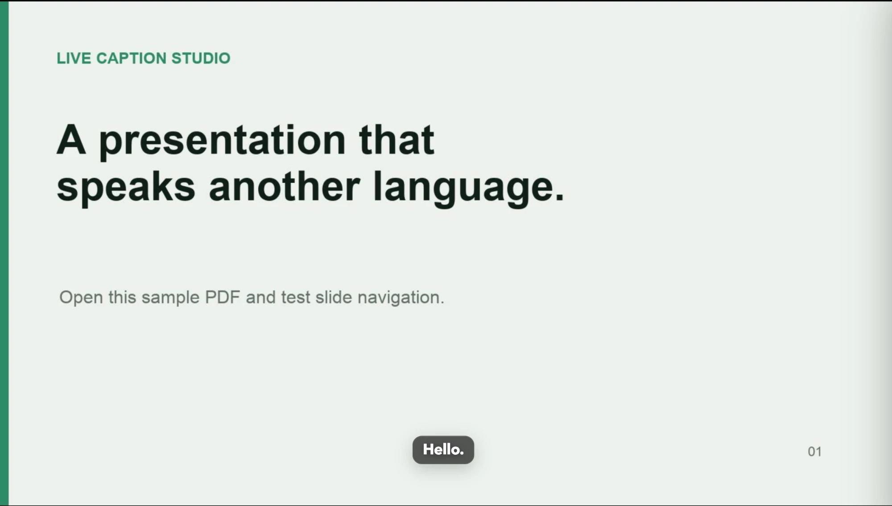

# Live Caption Studio

講中文時，將內容即時翻成英文、日文或韓文字幕，並直接疊在你的 PDF 簡報上。

這是一套在使用者電腦本機執行的開源工具。每位使用者使用自己的 Gemini API key，不共用開發者額度，也不需要把 PDF 上傳到雲端網站。

> Beta：Gemini 3.5 Live Translate 目前仍是 Preview 模型，API 格式、額度與可用性可能變動。



## 功能

- 上傳 PDF 後直接播放簡報
- 中文即時翻成英文、日文或韓文
- 選擇與測試麥克風
- 顯示或隱藏中文辨識對照
- 調整字幕大小與字幕疊加方式
- 鍵盤、滑鼠與簡報筆翻頁
- Gemini 斷線後自動重連
- 字幕直接疊在投影片上；Chrome 116 以上或 Edge 另可額外開啟 Picture-in-Picture 字幕浮窗
- Windows、macOS、Linux 本機執行

## 使用前準備

1. 安裝 [Python 3.10 以上版本](https://www.python.org/downloads/)。Windows 安裝時請勾選 **Add Python to PATH**。
2. 使用最新版 Chrome 或 Edge。其他瀏覽器可能無法使用字幕浮窗。
3. 到 [Google AI Studio](https://aistudio.google.com/app/apikey) 建立自己的 Gemini API key。

Google 正在把 Gemini API key 遷移至新的 Authorization key。2026 年 9 月後，未遷移的 Standard key 可能無法使用；建議直接在 Google AI Studio 建立最新類型的 key。

## 啟動方式

### Windows

雙擊 `start.bat`。

### macOS

第一次使用時，在 `start.command` 上按右鍵選擇「打開」。如果系統顯示沒有執行權限，可在終端機執行：

```bash
chmod +x start.command start.sh
./start.command
```

### Linux

```bash
chmod +x start.sh
./start.sh
```

第一次啟動會自動建立 `.venv` 並安裝必要套件，完成後瀏覽器會開啟 `http://127.0.0.1:5090`。

## 設定 Gemini API key

最簡單的方式是在首次啟動畫面貼上 key。它只會保留在本次 Python 程序的記憶體，關閉程式後自動清除。

如果是自己的固定電腦，也可以複製 `.env.example` 為 `.env`：

```bash
cp .env.example .env
```

再填入：

```dotenv
GEMINI_API_KEY=你的_API_key
```

`.env` 已排除於 Git 版控，但仍請把 API key 當成密碼保管。

## 操作方式

1. 選擇或拖曳 PDF。
2. 選擇英文、日文或韓文。
3. 確認 Gemini API key。
4. 測試麥克風後進入簡報。
5. 按「開始翻譯」。
6. 使用方向鍵、空白鍵、滑鼠或簡報筆翻頁。

也可以直接使用 [`sample/sample-presentation.pdf`](sample/sample-presentation.pdf) 測試 PDF 上傳與翻頁。

常用快捷鍵：

| 按鍵 | 功能 |
|---|---|
| `M` | 開始／停止翻譯 |
| `S` | 開關設定面板 |
| `C` | 顯示／隱藏中文對照 |
| `P` | 開關字幕浮窗 |
| `F` | 全螢幕 |
| `←` `→`、空白鍵 | 投影片翻頁 |
| `+` `-` | 調整字幕大小 |

## 隱私與資料流

- PDF 會傳給這台電腦上的 `127.0.0.1` 本機程式，用來轉成投影片圖片；不會傳到 Gemini 或其他雲端服務。
- 開始翻譯後，麥克風音訊會即時傳送到 Google Gemini，以取得中文辨識與翻譯字幕。
- 本工具不主動保存音訊、逐字稿或字幕內容。
- Gemini API 的資料處理方式仍受 Google 的服務條款與隱私政策約束。

## 已知限制

- 來源語言固定為中文，第一版只提供英文、日文、韓文輸出。
- Gemini 端到端翻譯模型無法可靠套用自訂術語表，`n8n`、人名與公司名等專有名詞可能翻錯。
- 加密、損毀、超過 50 MB 或超過 200 頁的 PDF 不支援。
- 字幕浮窗是額外功能，需要瀏覽器支援 Document Picture-in-Picture（Chrome 116 以上或 Edge）；不支援時字幕仍會正常疊在投影片上。
- 額度、速率限制與可能產生的 API 費用由使用者自己的 Google 專案承擔。

## 開發與測試

```bash
python3 -m venv .venv
source .venv/bin/activate
python -m pip install -r requirements.txt
python -m unittest discover -s tests -v
python app.py
```

如果環境裡已有 `GEMINI_API_KEY`，可以驗證 Gemini Live Translate 握手：

```bash
python scripts/gemini_smoke_test.py
```

## 授權

[MIT License](LICENSE)。PDF 轉圖使用 [pypdfium2](https://github.com/pypdfium2-team/pypdfium2)，其本身採 Apache-2.0／BSD-3-Clause，並包含 PDFium 的第三方授權。
